# CA6000 Assignment — Wine Quality Prediction

## 1. Introduction & Dataset Source

This case study asks whether routine physicochemical measurements can help predict a sensory assessment of Portuguese red Vinho Verde wine. We use the locally downloaded [`winequality-red.csv`](archive/winequality-red.csv) from the [Kaggle Red Wine Quality page](https://www.kaggle.com/datasets/uciml/red-wine-quality-cortez-et-al-2009/data); its original source is the [UCI Wine Quality repository](https://archive.ics.uci.edu/dataset/186/wine+quality) and the study by [Cortez et al. (2009)](https://doi.org/10.1016/j.dss.2009.05.016). The UCI collection also contains white wine; **this assignment uses only the red-wine CSV**. The supplied file has **1,599 observations, 11 continuous input variables and one integer `quality` target**. The observed target scores are 3–8, although the source describes the scoring scale as 0–10. The source provides no grape, producer, price or consumer data, so the findings apply to these measurements and sensory labels only.

| Dataset column | Role and interpretation |
|---|---|
| `fixed acidity` | Nonvolatile acidity reading. |
| `volatile acidity` | Volatile acidity reading; high values may reflect an unwanted vinegar-like character. |
| `citric acid` | Citric-acid reading. |
| `residual sugar` | Sugar remaining after fermentation. |
| `chlorides` | Chloride-content reading. |
| `free sulfur dioxide` | Free sulfur-dioxide reading. |
| `total sulfur dioxide` | Total sulfur-dioxide reading, which should not be below its free component. |
| `density` | Wine-density reading. |
| `pH` | Acidity/basicity on the pH scale. |
| `sulphates` | Sulphates reading. |
| `alcohol` | Alcohol-content reading. |
| `quality` | Sensory quality score; the **target**, never an input to the model. |

UCI does not supply units for every field in its variable table, so this report retains the dataset's numerical units rather than adding unverified conversions. We group the ordinal scores into **low (3–4), medium (5–6), high (7–8)** for the neural-network task in Section 5. The raw score remains unchanged for the descriptive analysis below. 

## 2. Data Import & Error Checking

The project reads the supplied **comma-delimited** file directly from the `archive` directory. This is important because the UCI-hosted original is sometimes distributed with a semicolon delimiter; the local Kaggle copy used here has commas. The complete executable audit is in [`eda_wine.py`](eda_wine.py), and its machine-readable results are in [`eda_results.json`](eda_results.json).

```python
import numpy as np
import pandas as pd
df = pd.read_csv("archive/winequality-red.csv", sep=",")
print(df.shape, df.dtypes, df.isna().sum(), df.duplicated().sum())
print(df.describe().T)
print((~np.isfinite(df.to_numpy(dtype=float))).sum())
```

The audit also verifies the 12 expected column names; checks that all fields are numeric; tests for negative chemistry readings, nonpositive density/alcohol, pH outside 0–14, noninteger or out-of-scale quality, and free sulfur dioxide greater than total sulfur dioxide. These are broad data-integrity screens, not a substitute for laboratory verification. The source file's SHA-256 is `d6a0d9bd24806944818795f22500c46cb6424cbff517aacda36595d3ed9b2daa`.

| Original-file check | Observed result | Interpretation |
|---|---:|---|
| Rows × columns | 1,599 × 12 | 11 inputs and one target. |
| Numeric types | 11 `float64`, 1 `int64` | No text-to-number conversion needed. |
| Missing / nonfinite numeric cells | 0 / 0 | No imputation needed on the original. |
| Domain and cross-field rule violations | 0 | No impossible values found by the stated rules. |
| Exact duplicate rows | **240** | 1,359 distinct rows remain after an optional `drop_duplicates()` sensitivity check. |
| Identical input vectors with conflicting scores | 0 | No observed disagreement among repeated inputs. |
| Rows flagged by at least one 1.5×IQR input fence | **405** | Review candidates, not confirmed errors. |

The IQR screen flags, for example, 155 `residual sugar`, 112 `chlorides`, 55 `total sulfur dioxide` and 13 `alcohol` readings. An IQR rule labels values far from the middle half of a distribution; it does **not** establish that they are erroneous. The source describes rare excellent and poor wines, so indiscriminate trimming could erase meaningful cases. The 240 exact duplicate rows are a genuine data-quality finding, but the file has no bottle identifier: they may represent repeated records or distinct wines with identical measured values. We retain them in this report to match the 1,599-row model results already given in Section 5. A row-wise random split can place identical records in more than one partition; thus the reported test accuracy should be interpreted with this possible optimistic bias in mind. A future grouped or deduplicated split would be a useful robustness test and would require retraining.

The full **input-feature** IQR flag counts are: fixed acidity 49, volatile acidity 19, citric acid 1, residual sugar 155, chlorides 112, free sulfur dioxide 30, total sulfur dioxide 55, density 45, pH 35, sulphates 59 and alcohol 13. The 405-row total counts each row once, even if several of its features are flagged. We do not apply the continuous-feature IQR rule to the discrete sensory score.

## 3. Data Cleaning & Fixes

**Actual dataset handling.** The original CSV has no missing, nonfinite or rule-invalid cells, so no values are imputed, clipped or deleted for the reported model experiment. The repeated rows and IQR flags are documented and retained for comparability with Section 5. The class label is derived from `quality` without overwriting the original score, and Section 5's `StandardScaler` is fitted on training data only. Distribution shape alone is not a reason to prohibit z-score standardisation; the reference notebook's switch to min–max scaling for that reason is not adopted here.

**Controlled cleaning exercise.** The assignment explicitly permits deliberately introduced errors to demonstrate cleaning. The following four changes were made **only to a deep copy** at fixed, zero-based row positions, then repaired with Pandas; they were not found in the downloaded data and were not used for model training.

| Copied-data cell | Deliberately inserted error | Detection | Demonstration repair | Before → after |
|---|---|---|---|---|
| Row 0, `alcohol` | `NaN` | `isna()` | `fillna()` with original median | 1 missing → 0; repaired value 10.2 |
| Row 1, `quality` | `99` | `between(0, 10)` | `mask()` and recover from the trusted original row | 1 invalid label → 0; restored value 5 |
| Row 2, `chlorides` | `-0.2` | `< 0` | `mask()` then `fillna()` with original median | 1 negative → 0; repaired value 0.079 |
| Row 3, `residual sugar` | `100` | extreme-value screen (`> 20`) and IQR | `clip()` at original Q3 + 1.5×IQR = 3.65 | 1 injected extreme → 0; demonstration value 3.65 |

```python
demo = df.copy(deep=True)
demo.loc[0, "alcohol"] = np.nan
demo.loc[1, "quality"] = 99
demo.loc[2, "chlorides"] = -0.2
demo.loc[3, "residual sugar"] = 100
demo["alcohol"] = demo["alcohol"].fillna(df["alcohol"].median())
demo["quality"] = demo["quality"].mask(~demo["quality"].between(0, 10)).fillna(df["quality"]).astype(int)
demo["chlorides"] = demo["chlorides"].mask(demo["chlorides"].lt(0)).fillna(df["chlorides"].median())
q1, q3 = df["residual sugar"].quantile([0.25, 0.75])
demo.loc[3, "residual sugar"] = demo.loc[[3], "residual sugar"].clip(upper=q3 + 1.5 * (q3-q1)).iloc[0]
```

The code checks all four error categories again after repair and confirms zero remain; it also verifies that the original DataFrame and source-file hash are unchanged. Recovering the synthetic bad *target* from the known original is possible because we intentionally altered that row; in a real dataset an unknown target should be checked against a trusted source or excluded, not guessed from other labels. Likewise, a blanket IQR cap on genuine wines would be unjustified. For an actual model with missing feature values, medians/caps must be learned **within the training partition** and then applied to validation/test data to prevent leakage.

## 4. Summary Statistics / EDA

### 4.1 Numerical summary

Table 1 uses **all 1,599 original rows** and Pandas sample variance (`ddof=1`). Each column has a count of 1,599. Variance is in squared dataset units, so its magnitude should only be compared within the same feature.

| Variable | Mean | Median | Sample variance | Q1–Q3 | Min–max |
|---|---:|---:|---:|---:|---:|
| fixed acidity | 8.3196 | 7.9000 | 3.0314 | 7.10–9.20 | 4.60–15.90 |
| volatile acidity | 0.5278 | 0.5200 | 0.0321 | 0.39–0.64 | 0.12–1.58 |
| citric acid | 0.2710 | 0.2600 | 0.0379 | 0.09–0.42 | 0.00–1.00 |
| residual sugar | 2.5388 | 2.2000 | 1.9879 | 1.90–2.60 | 0.90–15.50 |
| chlorides | 0.0875 | 0.0790 | 0.0022 | 0.07–0.09 | 0.012–0.611 |
| free sulfur dioxide | 15.8749 | 14.0000 | 109.4149 | 7.00–21.00 | 1.00–72.00 |
| total sulfur dioxide | 46.4678 | 38.0000 | 1082.1024 | 22.00–62.00 | 6.00–289.00 |
| density | 0.99675 | 0.99675 | 0.00000356 | 0.99560–0.99784 | 0.99007–1.00369 |
| pH | 3.3111 | 3.3100 | 0.0238 | 3.21–3.40 | 2.74–4.01 |
| sulphates | 0.6582 | 0.6200 | 0.0287 | 0.55–0.73 | 0.33–2.00 |
| alcohol | 10.4230 | 10.2000 | 1.1356 | 9.50–11.10 | 8.40–14.90 |
| quality | 5.6360 | 6.0000 | 0.6522 | 5.00–6.00 | 3–8 |

### 4.2 Outcome balance and feature distributions

The observed score counts are **3: 10, 4: 53, 5: 681, 6: 638, 7: 199, 8: 18**. After the report's label mapping, low / medium / high contain **63 (3.94%) / 1,319 (82.49%) / 217 (13.57%)** rows. A classifier that always chooses medium would therefore achieve 82.49% accuracy on the full dataset, making rare-class metrics essential alongside overall accuracy.

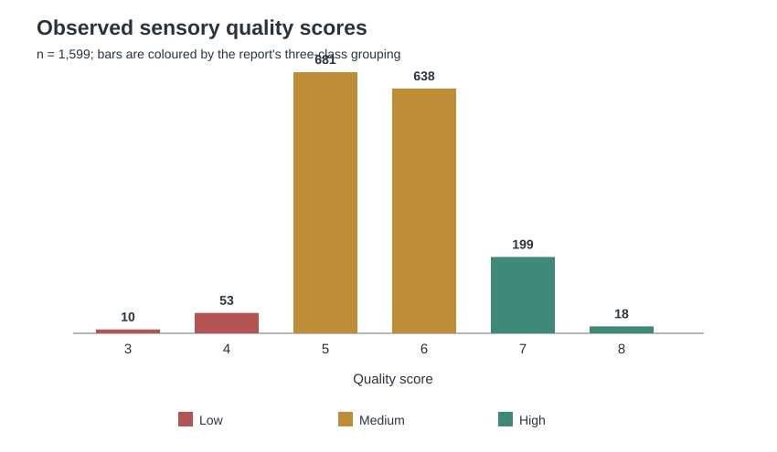

Figure 2 revisits the reference notebook's histograms with common binning and explicit axes. `residual sugar` and `chlorides` have pronounced right tails (sample skewness 4.54 and 5.68), while `density` and `pH` are much more symmetric (skewness 0.07 and 0.19). `fixed acidity` is **right**, rather than left, skewed in this file (skewness 0.98); thus the reference notebook's left-skew description is not repeated. These shapes help explain the IQR flag counts; they do not by themselves show bad measurements.

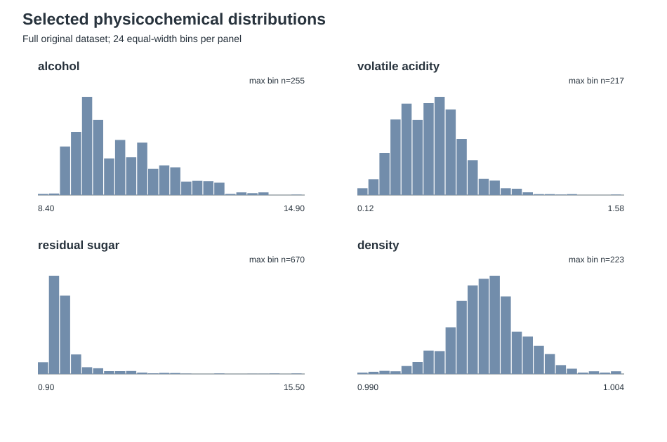

### 4.3 Relationships with sensory quality

Pearson correlations with the **original 3–8 quality score** are: `alcohol` **+0.476**, `volatile acidity` **−0.391**, `sulphates` **+0.251**, `citric acid` **+0.226**, `total sulfur dioxide` **−0.185**, and `residual sugar` **+0.014**. The last value is close to zero for a *linear* association; it does not rule out nonlinear relationships. Correlation describes association, not causation or standalone model importance.

| Report class | n | Mean alcohol | Mean volatile acidity | Mean sulphates |
|---|---:|---:|---:|---:|
| Low, score 3–4 | 63 | 10.216 | 0.724 | 0.592 |
| Medium, score 5–6 | 1,319 | 10.253 | 0.539 | 0.647 |
| High, score 7–8 | 217 | 11.518 | 0.406 | 0.743 |

The high class has higher mean alcohol and sulphates and lower mean volatile acidity in this sample. The low class has only 63 rows, so its mean is less stable than the medium-class mean. The two-dimensional count map in Figure 3 replaces heavily overlapping quality-versus-alcohol scatter points; Figure 4 adapts the reference notebook's empirical cumulative distribution idea to the report's **three** classes. Neither plot alone implies a causal effect.

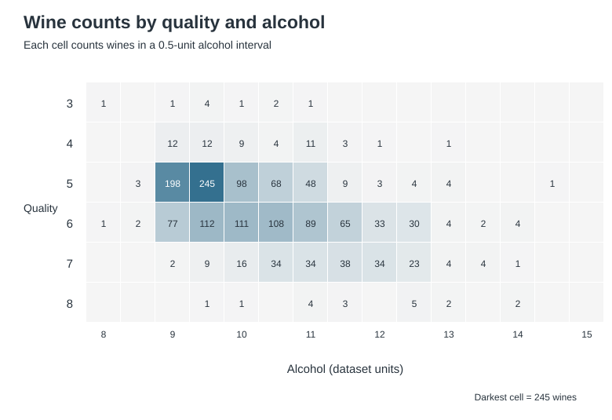

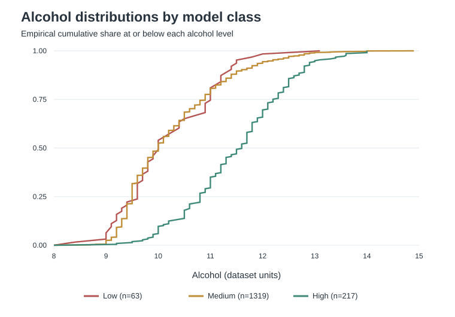

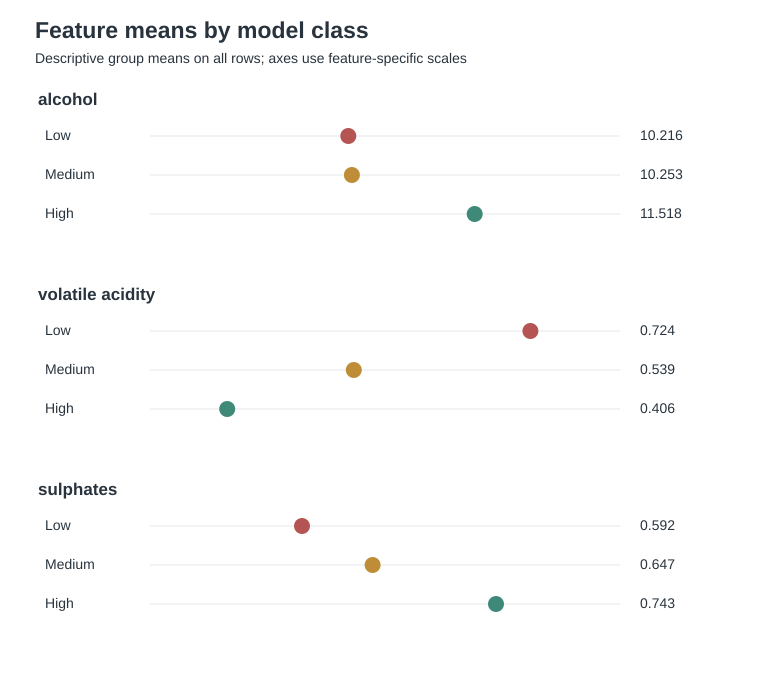

### 4.4 Relationships among inputs and implications

Usually we use pairplots, scatter/regression plots, joint density plots, hexagonal bins, Plotly heatmaps and Pearson tests to investigate pairwise structure. We condense those checks into the annotated matrix in Figure 6 and the count map above, avoiding multiple nearly identical figures and density smoothing across a discrete `quality` axis. The strongest selected input relationships are `fixed acidity` with `pH` (**−0.683**), `fixed acidity` with `density` (**+0.668**), `free sulfur dioxide` with `total sulfur dioxide` (**+0.668**) and `alcohol` with `density` (**−0.496**). The reference's claimed `alcohol`–`pH` nonrelationship is too strong: the measured correlation is **+0.206**, a modest linear association. Correlated inputs are not automatically an error; the small MLP and the tree can use them, although redundancy can affect interpretation.

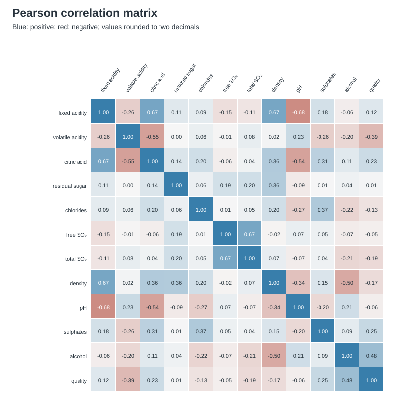

As a sensitivity check on the duplicate finding, `drop_duplicates()` leaves **1,359** rows with class counts **63 / 1,112 / 184**. The `alcohol`–quality correlation moves only from **+0.476** to **+0.480**, and `volatile acidity`–quality from **−0.391** to **−0.395**. This suggests the two leading descriptive associations are stable to exact-row deduplication, while it does **not** validate the Section 5 accuracy under a new split. The reference notebook's 3D surface views use arbitrary row order as one axis and do not answer a meaningful scientific question here, so the report instead shows distributions, conditional counts and correlations. All these EDA calculations use the full labelled CSV for **description**; they are not fitted preprocessing steps or a basis for choosing hyperparameters on the held-out test set.

## 5. Model Part

### 5.1 Labels & Split

#### Label Construction: why 3 classes

Before model training, the classification logic for labels must be defined. Although binary classification can yield a more balanced class distribution and standard evaluation metrics (such as AUC-ROC and F1-score), this study ultimately adopts a three-class classification approach for two core reasons:

Closeness to real-world scenarios: It preserves the actual market distribution (premium-grade and defective wines are both rare in the real market), avoiding the practice of ambiguously merging medium-quality wines into the two extreme classes.
Capability demonstration of the model: Its inherent class imbalance provides a robust benchmark to intuitively demonstrate the neural network’s learning performance on highly skewed datasets.

**Class sizes after labelling:**

| 3-class label | quality range | n_samples | percentage |
|:---|---:|---:|---:|
| low (0) | 3–4 | 63 | 3.94 |
| medium (1) | 5–6 | 1319 | 82.49 |
| high (2) | 7–8 | 217 | 13.57 |
It can be observed that the sample dataset is highly imbalanced, especially with very few wine samples labelled as low quality.

#### Train / Validation / Test Split (70 / 15 / 15, stratified)

We use a 70 / 15 / 15 stratified split with **fixed seed 4**: the seed fixes the random data split, the decision-tree baseline and the MLP initialisation. The validation set is used for hyper-parameter selection and early stopping, the **test set is held out until the very end** and evaluated exactly once, and `stratify=` keeps the class proportions approximately similar across the splits, subject to integer rounding.

**Resulting split sizes and class counts:**

| split | n_samples | fraction | low / medium / high |
|:---|---:|---|:---|
| train | 1119 | 70% | 44 / 923 / 152 |
| validation | 240 | 15% | 9 / 198 / 33 |
| test | 240 | 15% | 10 / 198 / 32 |

### 5.2 Preprocessing
Features live on very different scales (e.g. `total sulfur dioxide` ≈ 46 vs `density` ≈ 0.997); each feature is z-score standardised with `StandardScaler` — **fit on the training set only** to prevent data leakage — and wrapped into PyTorch DataLoaders (shuffled for training only).

### 5.3 Baseline: Decision Tree

Before training a neural network we need a **reference point**. A decision tree is a strong, interpretable non-linear baseline.A few `max_depth` values are tried and the best is selected on the **validation set** 

**Validation accuracy by depth:** depth 5 is best (0.8458); deeper trees do **not** help — with only ~1,120 training samples they overfit, and validation accuracy drops.

| max_depth | val_accuracy |
|---:|---:|
| 3 | 0.8292 |
| 5 | 0.8458 |
| 7 | 0.825 |
| 10 | 0.8292 |
| None | 0.7833 |

The test-set confusion counts show the effect of the imbalance directly: the tree **barely detects "low" at all** — it predicts exactly 1 of the 10 low wines correctly **(recall 0.1)**. For "high" wines, it correctly predicts 16 of 32 **(recall 0.5)**, misclassifying the other 16 as "medium".

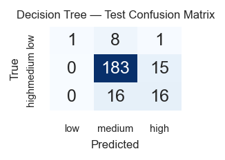

### 5.4 MLP Design

**Architecture:** `11 → 64 → 32 → 3`, with ReLU activations and Dropout (0.3) after each hidden layer. The hidden layers are deliberately small (~1,120 training samples — a larger network would memorise); dropout adds further regularisation. The output layer produces raw **logits** and `CrossEntropyLoss` applies the softmax internally.

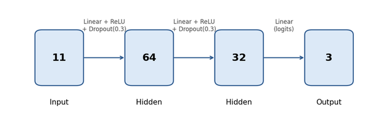

### 5.5 Loss & Optimizer

Because the classes are imbalanced, `CrossEntropyLoss` uses **sqrt-inverse-frequency class weights** (computed from the training set only, giving `[2.912, 0.636, 1.567]`). Adam (lr 1e-3, weight decay 1e-4) is combined with `ReduceLROnPlateau` (halve the LR after 10 plateaued epochs).

```python
criterion=nn.CrossEntropyLoss(weight=class_weights)
optimizer=torch.optim.Adam(model.parameters(), lr=1e-3, weight_decay=1e-4)
```

### 5.6 Training Loop

Each epoch runs a training pass (mini-batches of 64: zero gradients → forward → loss → backward → update) and a validation pass (`model.eval()`), with early stopping on the validation loss (patience 40). Training stopped at epoch 95 (best validation loss 0.6638 at epoch 55).

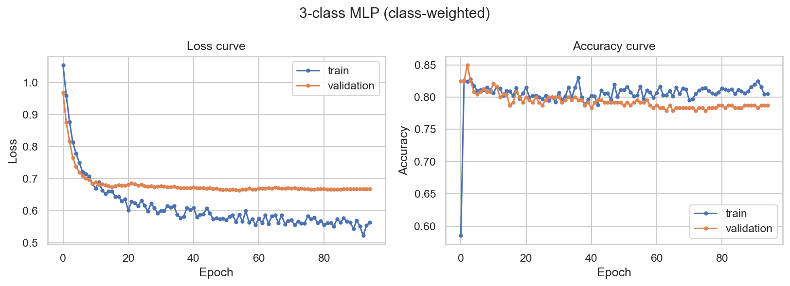

### 5.7 Test Evaluation (argmax)
The test set is used exactly once. Under the default `argmax` rule the MLP reaches **0.8333 test accuracy and 0.6347 macro-F1** (decision tree: 0.8333 / 0.5285) — equal accuracy to the tree and above the majority baseline (0.825), with a far better balance across classes. The MLP detects 4 of the 10 "low" wines (recall 0.4 vs the tree's 0.1) and 21 of the 32 "high" wines (recall 0.6562 vs 0.5); the full per-metric comparison follows in Section 5.8.

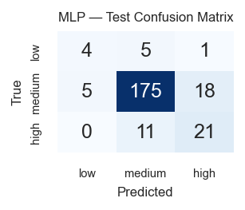
### 5.8 Operating-Point Tuning: Probability Multipliers

`argmax` maximises accuracy, but under class imbalance the metric that matters is **macro-F1** — and the two are not maximised by the same operating point. We adjust the operating point with **probability multipliers**, i.e. by re-weighting the class probabilities before the argmax:

ŷ = argmax_c ( w_c · P(y = c | X) )

with w_medium = 1 and w_low, w_high ≥ 1 amplifying the rare classes. We grid-search w_low, w_high ∈ {1.0, 1.5, 2.0, 3.0, 4.0} on the **validation set**, maximising macro-F1, and apply the **same procedure to both models**:

| metric | Decision Tree | MLP |
|:---|---:|---:|
| operating point (tuned on val) | w_low=3.0, w_high=3.0 | w_low=1.0, w_high=1.5 |
| accuracy | 0.8042 | **0.8167** |
| **macro F1** | 0.5422 | **0.631** |
| F1 (low) | 0.2857 | **0.4211** |
| recall (low) | 0.2 | **0.4** |
| precision (low) | **0.5** | 0.4444 |
| F1 (high) | 0.4571 | **0.5854** |
| recall (high) | 0.5 | **0.75** |
| precision (high) | 0.4211 | **0.48** |

Two findings: the MLP's selected multiplier changes little from the default (w = [1, 1, 1.5]), and it beats the tree on **both** rare classes at the reported operating points; the tuned tree (w = [3, 1, 3]) buys a slightly better "low" F1 (0.1818 → 0.2857) at the cost of "high" (0.5000 → 0.4571) and accuracy (0.8333 → 0.8042), and still loses both rare classes to MLP. These results alone do not isolate the effect of training-time class weights.

### 5.9 Precision-Recall Analysis (Average Precision)

Hard predictions at a single operating point hide the full precision-recall trade-off, so we plot per-class (one-vs-rest) curves and report the average precision (AP):

| class | Decision Tree AP | MLP AP |
|:---|---:|---:|
| low | 0.3212 | **0.3325** |
| medium | 0.9197 | **0.9246** |
| high | 0.4090 | **0.5640** |

The MLP ranks every class at least as well as the tree — most decisively on "high" (AP 0.5640 vs 0.4090). The operating points reported in Section 5.8 show the precision–recall trade-off at the selected probability multipliers.

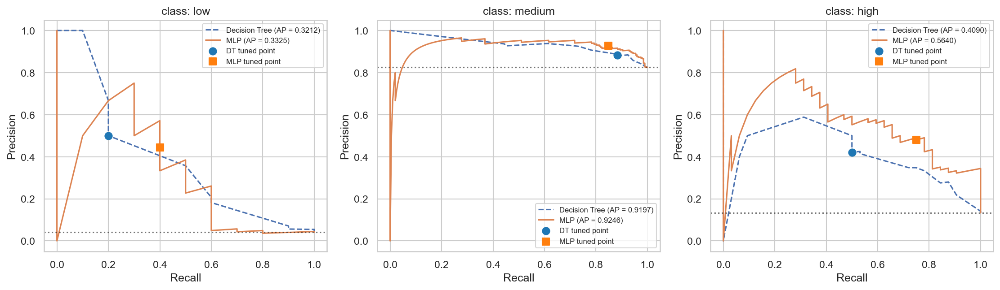
## 6. Accuracy Summary

At the default `argmax` rule, the MLP reaches **83.33% test accuracy and 0.6347 macro-F1**, versus 83.33% accuracy and 0.5285 macro-F1 for the decision tree — equal accuracy, far better balance. At the tuned operating points (Section 5.8) the MLP moves only slightly (0.6347 → 0.6310 with w = [1, 1, 1.5]), while the tree improves to 0.5422 (w = [3, 1, 3]) but still loses both rare classes. The decisive difference is the rare classes: the MLP detects 40% of "low" wines (F1 0.4211 vs the tree's 0.1818, or 0.2857 tuned) and 65.62% of "high" wines at argmax — 75% when tuned (F1 0.5833 / 0.5854 vs the tree's 0.5 / 0.4571). The per-class AP values confirm the same ranking, most decisively on "high": 0.5640 vs 0.4090.

## 7. Use of AI Tools

**Tool:** Doubao (ByteDance AI assistant). Usage record: <https://www.doubao.com/thread/xgi7I398K1tqDz2SJ>

**Knowledge-level assistance:**

- Learned how `ReduceLROnPlateau` lowers the learning rate automatically.
- Asked whether tuning can be performed at inference time — which methods can optimise the decision rule of a 3-class classifier and how to locate the optimal operating point.
- Asked which metrics best reflect model capability on imbalanced datasets.

**Code-level assistance:**

- Generated code for the tables and figures in the original model notebook/report.
- Generated the code for the data split, standardisation and `DataLoader` construction; supplemented the decision-tree training code (max-depth selection); generated the optimiser, the training/evaluation loop, and the implementation of operating-point tuning with probability multipliers.

**Language / polishing assistance:**

- Translated all Chinese draft content into English for this report.

**Additional assistance for Sections 1–4:** OpenAI Codex was used to inspect the assignment requirements, the downloaded reference notebook and the local CSV; draft the reproducible [`eda_wine.py`](eda_wine.py) audit and six SVG charts. Its numerical claims were checked by executing the script against the supplied CSV. The deliberately injected errors are explicitly separated from the original-file findings. The script and [`eda_results.json`](eda_results.json) are included so the analysis can be inspected and rerun.

## 8. Conclusion

- The **3-class MLP** clearly outperforms the decision-tree baseline under class imbalance: equal test accuracy (0.8333) but a much higher macro-F1 (0.6347 vs 0.5285), and it is the only model that meaningfully detects the rare "low" and "high" wines (details in Sections 5.7–5.9 and Section 6).
- The MLP uses class-weighted training and a validation-selected operating point to address imbalance. The comparison with the decision tree shows better rare-class results for this MLP, but no unweighted-MLP ablation was supplied, so the contribution of class weighting alone cannot be quantified.
- Exact duplicate records remain in the 1,599-row experiment. Repeating the evaluation with a grouped or deduplicated split would test whether row overlap inflated the reported accuracy; that experiment was not part of the supplied model results.
